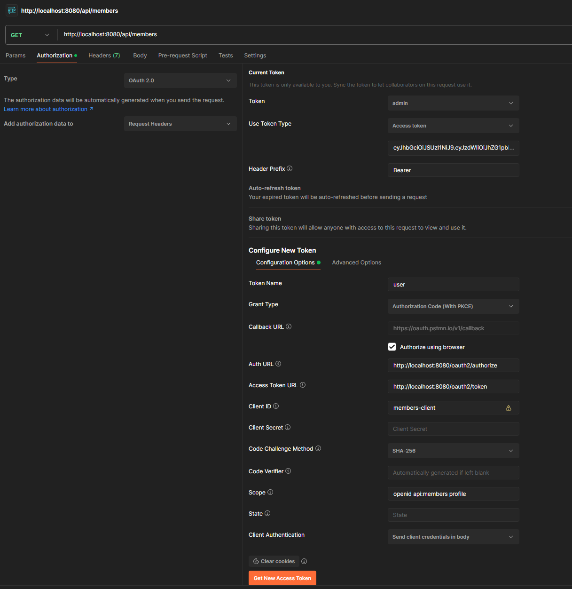

# KitchenSink Java Project
## Overview
KitchenSink is a Java 21-based project that leverages MongoDB as its database and includes a full local development setup with Docker Compose and Dockerfile.
It also incorporates OAuth2 OIDC flow (with PKCE) for authentication and authorization. 

This repository provides a simple and straightforward approach to running the KitchenSink application locally using Docker Compose.

## Steps to run locally

```shell
docker-compose up -d
```

Once the application is running, you can access it locally at: [http://localhost:9000](http://localhost:9000)

## OAuth2 Login Flow Using Postman

